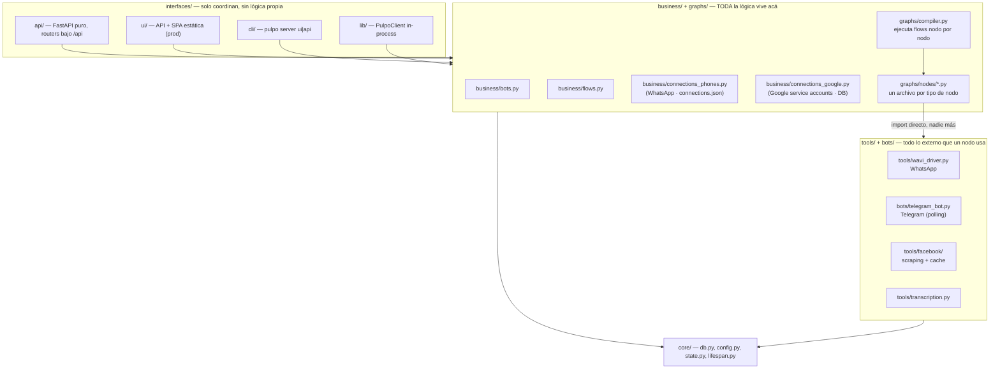
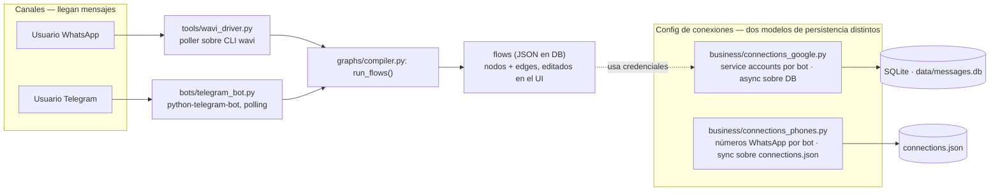

# ADR-007: Diagramas de arquitectura, dominio de conexiones separado, nodo fetch dividido

**Estado:** Aceptado — julio 2026

## Contexto

Tras el "gran refactor" (worktree `refactor/`, ver memoria de proyecto) no quedó
ningún artefacto visual del sistema — ni un diagrama, ni una sección que mostrara
qué módulo le puede hablar a cuál. La sección de arquitectura del admin (`/dashboard?arquitectura=1`)
mostraba rutas y tipos de nodo en texto, pero nada que explicara el ordenamiento
por capas.

Además, una auditoría forense (git log + referencias reales de uso, no solo
"no lo importa nadie") encontró:

- `pulpo/business/connections.py` mezclaba dos modelos de persistencia distintos
  (números de WhatsApp sobre `connections.json`, sync; cuentas de servicio de
  Google sobre la DB, async) en un solo archivo sin una responsabilidad clara.
- `pulpo/nodes/` (paquete paralelo a `pulpo/graphs/nodes/`) tenía scripts de
  debug/duplicados obsoletos mezclados con código de scraping de Facebook que
  sí estaba vivo en producción.
- `pulpo/graphs/luganense.py` (416 líneas) estaba muerto — el compiler solo lee
  flows de la DB — y si se ejecutaba, crasheaba (importaba módulos inexistentes).
- El nodo `FetchNode` genérico decidía su comportamiento con un campo
  `config.source: "http" | "facebook"`, mezclando dos responsabilidades bajo
  un mismo tipo de nodo en el editor visual de flows.
- `pulpo/core/sim_engine.py` defaulteaba a **bots reales** cuando `ENABLE_BOTS`
  no está seteado en el entorno — solo `start.sh`/launchd lo exportan
  explícitamente. Correr `pulpo` directo (bypaseando esos scripts) arrancaba
  el bot real de Telegram por accidente. Esto causó un incidente real durante
  la propia sesión de este refactor (conflicto de polling con producción).

## Decisión

1. **Reorganizar por responsabilidad, no borrar sin evidencia.** Cada archivo
   candidato a "basura" se verificó con `git log --follow`, grep de referencias
   reales, y si aparecía documentado como herramienta operacional (ej. scripts
   de renovación de cookies de Facebook). Solo se borró lo doblemente confirmado
   como muerto o duplicado obsoleto.
2. **`business/connections.py` → `connections_phones.py` + `connections_google.py`**,
   una responsabilidad y un modelo de persistencia por archivo.
3. **`FetchNode` → `FetchHttpNode` + `FetchFbNode`**, sin selector `source`.
   Migración one-shot idempotente (`migrate_fetch_node_types`, corre en cada
   startup) reescribe los flows ya persistidos en la DB.
4. **`sim_engine.SIM_MODE` default corregido a fail-safe**: sin `ENABLE_BOTS`
   seteado, el sistema arranca en modo simulado. Producción sigue seteando
   `ENABLE_BOTS=true` explícitamente vía el plist de launchd — no cambia nada
   ahí, solo cierra el agujero para invocaciones manuales.
5. **Dos diagramas mermaid**, mantenidos a mano (no generados dinámicamente),
   renderizados client-side en la sección de arquitectura del admin
   (`frontend/src/architectureDiagrams.js` + `MermaidDiagram.jsx`) y espejados
   acá abajo para que también se vean en GitHub sin depender de la UI corriendo.

### Diagrama 1 — Capas: quién puede importar a quién

### Diagrama 2 — Conexiones: canales, drivers y dónde persiste cada uno

## Consecuencias

- Los diagramas se mantienen **a mano** — no se generan del código. Revisar
  cuando se mueven o renombran módulos (mismo mandato que el resto del
  `CLAUDE.md`). Si divergen de la realidad, valen menos que nada.
- El catálogo de tipos de nodo (`pulpo flows node-types`, sección "Motor de
  flows" del dashboard) sí es dinámico — se deriva de `NODE_REGISTRY` en
  tiempo real, no requiere mantenimiento manual cuando se agregan nodos.
- `pulpo/nodes/` como paquete dejó de existir. Cualquier código nuevo de
  scraping/integración externa va a `pulpo/tools/`.
